# day07_导入数据到索引库


# 0.学习目标

- 理解索引库数据结构设计
- 能够把商品数据导入到索引库
- 能实现搜索补全功能
- 能实现基本搜索功能

# 1.ElasticSearch的starter（了解）

ElasticSearch的异步API代码编写比较复杂，因此我们需要封装成工具，方便后期的使用。而且最好与SpringBoot整合，完成自动配置的starter。最终达成与MybatisPlus一样的效果：

- 用户定义接口并继承我们的接口，获取CRUD的方法
- 我们实现接口中的方法
- 通过动态代理来代理用户接口，并注入Spring容器
- 实现自动配置

我们大概会经过这样几个步骤来完成：

- 定义工具类
- 与spring整合
- 形成starter

## 1.1.搭建工程

SpringBoot的starter结构一般如下：

- spring-boot-xxx-autoconfigure：实现自动配置的代码、工具类、配置类等
- spring-boot-starter-xxx：管理spring-boot-xxx-autoconfigure及其它所需依赖的版本

因此我们如果要自定义工具类，并且实现starter，项目结构也是如此，包含：

- leyou-starters：父工程，起聚合作用，方便开发
  - elastic-spring-boot-autoconfigure：工具类、配置类等
  - elastic-spring-boot-starter：引入spring-boot-xxx-autoconfigure及其它所需依赖

### 1.1.1.创建父工程：

创建一个普通maven工程

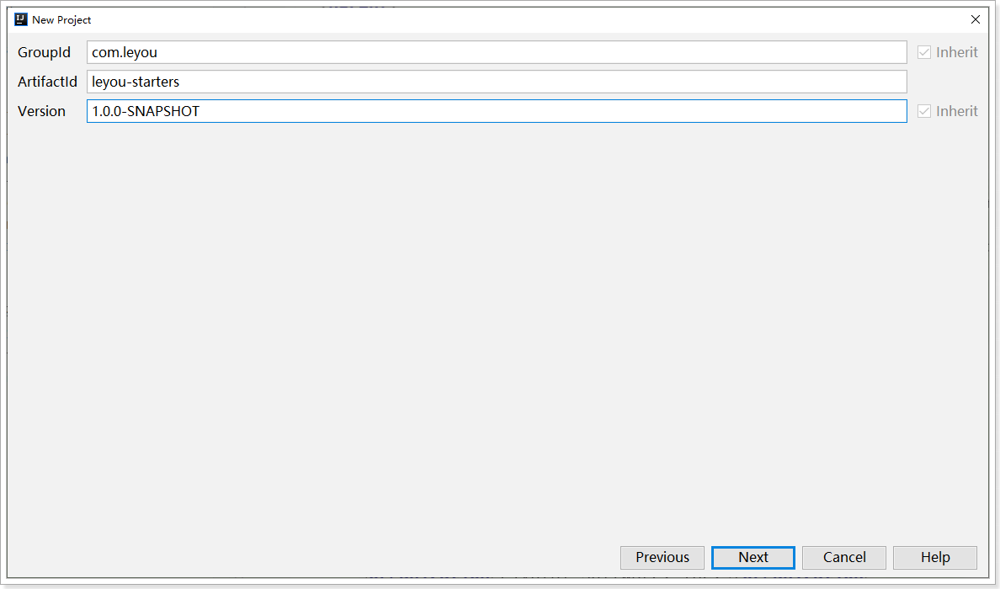

位置：

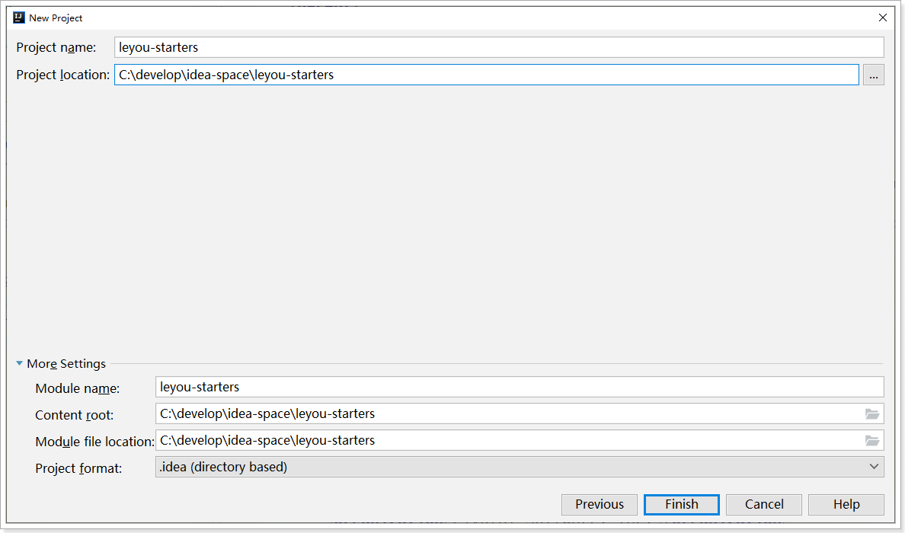

pom：

```xml
<?xml version="1.0" encoding="UTF-8"?>
<project xmlns="http://maven.apache.org/POM/4.0.0"
         xmlns:xsi="http://www.w3.org/2001/XMLSchema-instance"
         xsi:schemaLocation="http://maven.apache.org/POM/4.0.0 http://maven.apache.org/xsd/maven-4.0.0.xsd">
    <modelVersion>4.0.0</modelVersion>

    <groupId>com.leyou</groupId>
    <artifactId>leyou-starters</artifactId>
    <version>1.0.0-SNAPSHOT</version>

    <packaging>pom</packaging>

    <properties>
        <spring.boot.version>2.1.12.RELEASE</spring.boot.version>
        <elasticsearch.version>7.4.2</elasticsearch.version>
    </properties>
    <build>
        <plugins>
            <plugin>
                <groupId>org.apache.maven.plugins</groupId>
                <artifactId>maven-compiler-plugin</artifactId>
                <version>3.8.1</version>
                <configuration>
                    <source>1.8</source>
                    <target>1.8</target>
                    <encoding>UTF-8</encoding>
                </configuration>
            </plugin>
        </plugins>
    </build>
</project>
```


### 1.1.2.AutoConfigure

然后是搭建AutoConfigure模块。

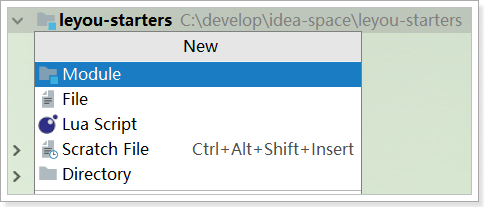 

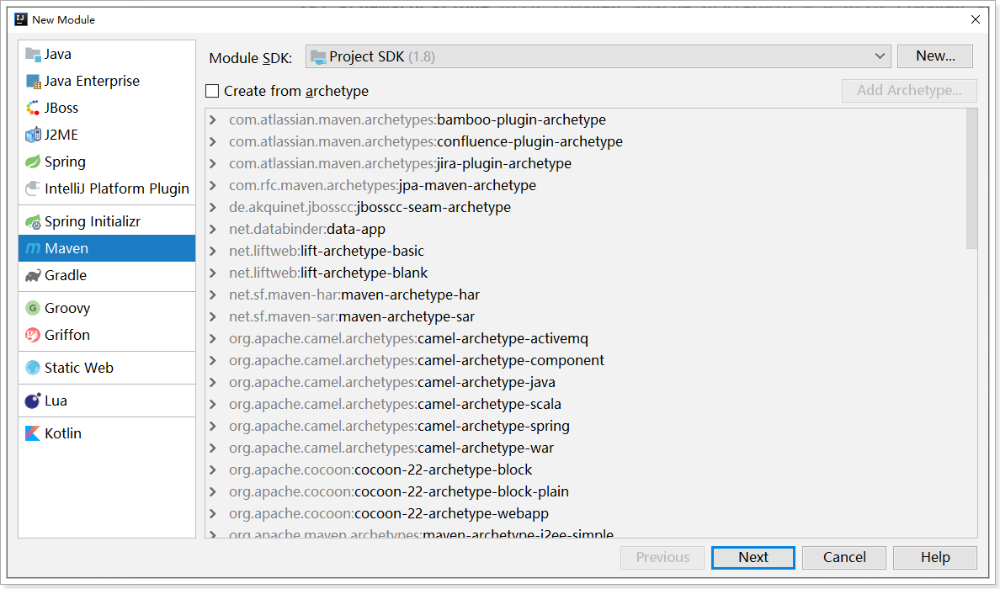

坐标：

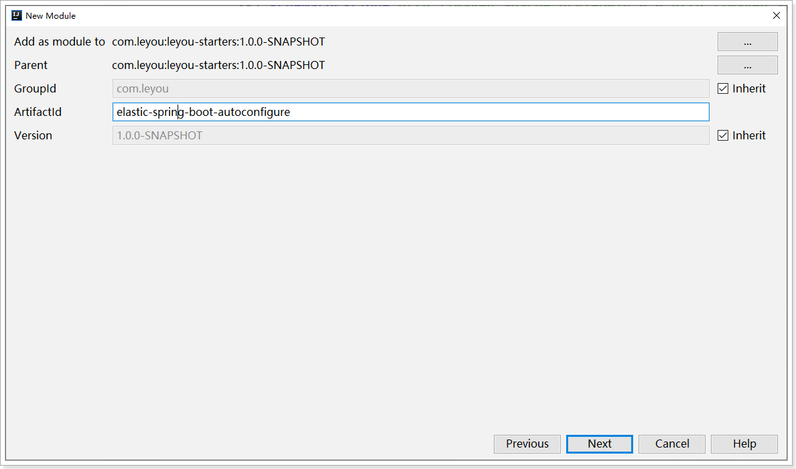

依赖：

```xml
<?xml version="1.0" encoding="UTF-8"?>
<project xmlns="http://maven.apache.org/POM/4.0.0"
         xmlns:xsi="http://www.w3.org/2001/XMLSchema-instance"
         xsi:schemaLocation="http://maven.apache.org/POM/4.0.0 http://maven.apache.org/xsd/maven-4.0.0.xsd">
    <parent>
        <artifactId>leyou-starters</artifactId>
        <groupId>com.leyou</groupId>
        <version>1.0.0-SNAPSHOT</version>
    </parent>
    <modelVersion>4.0.0</modelVersion>

    <artifactId>elastic-spring-boot-autoconfigure</artifactId>

    <dependencies>
        <!--springboot 自动配置基本依赖-->
        <dependency>
            <groupId>org.springframework.boot</groupId>
            <artifactId>spring-boot-autoconfigure</artifactId>
            <version>${spring.boot.version}</version>
            <scope>compile</scope>
        </dependency>
        <dependency>
            <groupId>org.springframework.boot</groupId>
            <artifactId>spring-boot-configuration-processor</artifactId>
            <version>${spring.boot.version}</version>
            <optional>true</optional>
        </dependency>
        <!--elasticsearch依赖-->
        <dependency>
            <groupId>org.elasticsearch.client</groupId>
            <artifactId>elasticsearch-rest-high-level-client</artifactId>
            <version>${elasticsearch.version}</version>
            <scope>compile</scope>
        </dependency>
        <!--JSON依赖-->
        <dependency>
            <groupId>com.fasterxml.jackson.core</groupId>
            <artifactId>jackson-databind</artifactId>
            <version>2.9.10.3</version>
            <scope>compile</scope>
        </dependency>
        <!--通用模块-->
        <dependency>
            <groupId>org.apache.commons</groupId>
            <artifactId>commons-lang3</artifactId>
            <version>3.9</version>
            <scope>compile</scope>
        </dependency>
        <dependency>
            <groupId>commons-beanutils</groupId>
            <artifactId>commons-beanutils</artifactId>
            <version>1.9.3</version>
            <scope>compile</scope>
        </dependency>
        <!--响应式API 依赖-->
        <dependency>
            <groupId>io.projectreactor.netty</groupId>
            <artifactId>reactor-netty</artifactId>
            <version>0.8.15.RELEASE</version>
            <scope>compile</scope>
        </dependency>
        <!--日志相关-->
        <dependency>
            <groupId>ch.qos.logback</groupId>
            <artifactId>logback-classic</artifactId>
            <version>1.2.3</version>
            <scope>compile</scope>
        </dependency>
        <dependency>
            <groupId>org.apache.logging.log4j</groupId>
            <artifactId>log4j-to-slf4j</artifactId>
            <version>2.11.2</version>
            <scope>compile</scope>
        </dependency>
        <dependency>
            <groupId>org.slf4j</groupId>
            <artifactId>jul-to-slf4j</artifactId>
            <version>1.7.30</version>
            <scope>compile</scope>
        </dependency>
    </dependencies>
</project>
```


### 1.1.3.Starter模块

然后是starter模块，与AutoConfigure模块一样，是一个普通maven模块

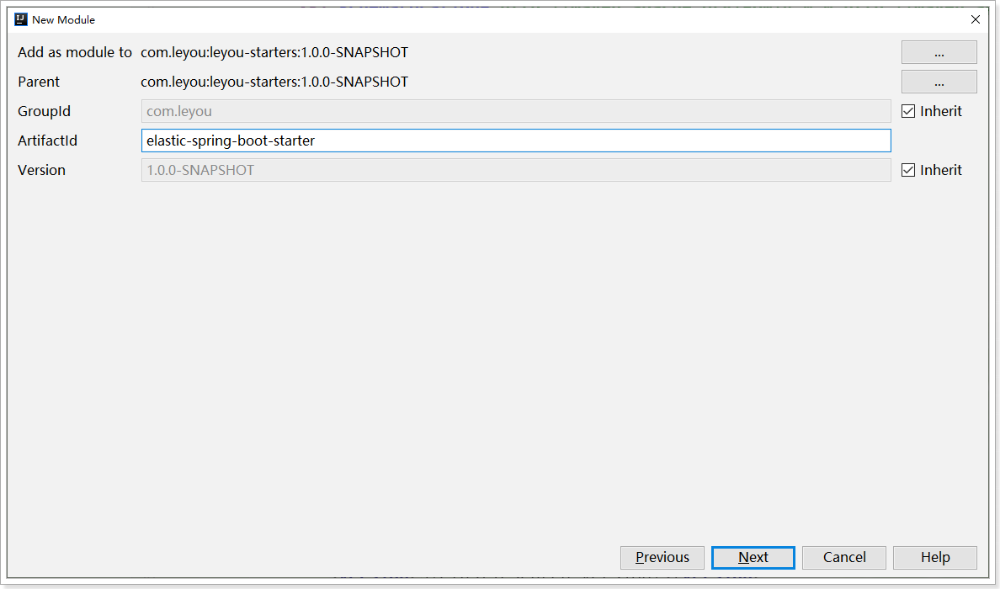

依赖如下：

```xml
<?xml version="1.0" encoding="UTF-8"?>
<project xmlns="http://maven.apache.org/POM/4.0.0"
         xmlns:xsi="http://www.w3.org/2001/XMLSchema-instance"
         xsi:schemaLocation="http://maven.apache.org/POM/4.0.0 http://maven.apache.org/xsd/maven-4.0.0.xsd">
    <parent>
        <artifactId>leyou-starters</artifactId>
        <groupId>com.leyou</groupId>
        <version>1.0.0-SNAPSHOT</version>
    </parent>
    <modelVersion>4.0.0</modelVersion>

    <artifactId>elastic-spring-boot-starter</artifactId>

    <dependencies>
        <dependency>
            <groupId>com.leyou</groupId>
            <artifactId>elastic-spring-boot-autoconfigure</artifactId>
            <version>1.0.0-SNAPSHOT</version>
        </dependency>
        <dependency>
            <groupId>org.springframework.boot</groupId>
            <artifactId>spring-boot-starter-logging</artifactId>
            <version>${spring.boot.version}</version>
        </dependency>
    </dependencies>
</project>
```


## 1.2.定义工具类

课程中为了时间考虑，我们只把核心需要的几个功能封装，并不追求功能的完整性，包括下列方法：

- 创建索引库和映射
- 删除索引库
- 新增文档
- 查询文档
- 删除文档
- 搜索并实现分页、高亮、排序
- 自动补全查询

因为包含分页查询，因此需要一个DTO，代表分页结果，

我们在`com.leyou.starter.elastic.entity`包下定义一个类：

```java
package com.leyou.starter.elastic.entity;

import java.util.List;


public class PageInfo<T> {
    private long total;
    private List<T> content;

    public PageInfo() {
    }

    public PageInfo(long total, List<T> content) {
        this.total = total;
        this.content = content;
    }

    public long getTotal() {
        return total;
    }

    public void setTotal(long total) {
        this.total = total;
    }

    public List<T> getContent() {
        return content;
    }

    public void setContent(List<T> content) {
        this.content = content;
    }
}
```


### 1.2.1.定义工具接口

首先我们在`com.leyou.starter.elastic.repository`包中定义一个接口，声明需要的方法：

```java
package com.leyou.starter.elastic.repository;

import com.leyou.starter.elastic.dto.PageInfo;
import org.elasticsearch.search.builder.SearchSourceBuilder;
import reactor.core.publisher.Mono;

import java.util.List;

/**
 * 定义了操作Elasticsearch的CRUD的功能 <br/>
 * 泛型说明 <br/>
 * T：实体类类型
 * ID：实体类中的id类型
 */
public interface Repository<T, ID> {
    /**
     * 创建索引库
     *
     * @param source setting和mapping的json字符串
     * @return 是否创建成功
     */
    Boolean createIndex(String source);

    /**
     * 删除当前实体类相关的索引库
     *
     * @return 是否删除成功
     */
    Boolean deleteIndex();

    /**
     * 新增数据
     *
     * @param t 要新增的数据
     * @return 是否新增成功
     */
    boolean save(T t);

    /**
     * 批量新增
     *
     * @param iterable 要新增的数据结婚
     * @return 是否新增成功
     */
    boolean saveAll(Iterable<T> iterable);

    /**
     * 根据id删除数据
     *
     * @param id id
     * @return 是否删除成功
     */
    boolean deleteById(ID id);

    /**
     * 异步功能，根据id查询数据
     *
     * @param id id
     * @return 包含实体类的Mono实例
     */
    Mono<T> queryById(ID id);


    /**
     * 根据{@link SearchSourceBuilder}查询数据，返回分页结果{@link PageInfo}，其中的数据已经高亮处理
     *
     * @param sourceBuilder 查询条件构建器
     * @return 结果处理器处理后的的数据
     */
    Mono<PageInfo<T>> queryBySourceBuilderForPageHighlight(SearchSourceBuilder sourceBuilder);

    /**
     * 根据指定的prefixKey对单个指定suggestField 做自动补全，返回推荐结果的列表{@link List}
     * @param suggestField 补全字段
     * @param prefixKey 关键字
     * @return 返回推荐结果列表{@link List}
     */
    Mono<List<String>> suggestBySingleField(String suggestField, String prefixKey);
}
```


### 1.2.2.定义实现类

我们在`com.leyou.starter.elastic.repository`包中定义实现类，暂时不实现代码：

```java
package com.leyou.starter.elastic.repository;


public class RepositoryHandler<T, ID> implements Repository<T, ID> {

    /**
     * Elasticsearch的客户端
     */
    private final RestHighLevelClient client;
    /**
     * 索引库名称
     */
    private String indexName;

    public RepositoryHandler(RestHighLevelClient client, String indexName){
        this.client = client;
        this.indexName = indexName;
    }

    // ...
}

```

解读：

通过构造函数我们注入了两个属性：

- RestHighLevelClient client：操作elasticsearch需要用到的客户端
- String indexName：要操作的索引库名称


### 1.2.3.创建和删除索引库

先来实现索引库操作：

```java
@Override
public Boolean createIndex(String source) {
    try {
        // 发起请求，准备创建索引库
        CreateIndexResponse response = client.indices().create(
            new CreateIndexRequest(indexName).source(source, XContentType.JSON),
            RequestOptions.DEFAULT);
        // 返回执行结果
        return response.isAcknowledged();
    } catch (IOException e) {
        throw new RuntimeException(e);
    }
}

@Override
public Boolean deleteIndex() {
    try {
        // 发起请求，删除索引库
        AcknowledgedResponse response = client.indices()
            .delete(new DeleteIndexRequest(indexName), RequestOptions.DEFAULT);
        // 返回执行结果
        return response.isAcknowledged();
    } catch (IOException e) {
        throw new RuntimeException(e);
    }
}
```

这两个都是同步操作，没有调用异步的API。


### 1.2.4.新增文档

新增文档代码如下：

```java
@Override
public boolean save(T t) {
    try {
        // 从对象中获取id
        String id = getID(t);
        // 把对象转为JSON
        String json = toJson(t);
        // 准备请求
        IndexRequest request = new IndexRequest(indexName)
            .id(id)
            .source(json, XContentType.JSON);
        // 发出请求
        IndexResponse response = client.index(request, RequestOptions.DEFAULT);
        // 判断是否有失败
        return response.getShardInfo().getFailed() == 0;
    } catch (IOException e) {
        throw new RuntimeException(e);
    }
}
```

注意，新增的时候需要做两件事情：

- 获取文档数据中的ID属性：这里通过一个getID()方法来获取，这个方法暂时空实现

  ```java
  private String getID(T t) {
      // TODO 待完成
  	return "";
  }
  ```

- 将文档转为JSON格式：这里通过Jackson的ObjectMapper来封装方法toJson()

  ```java
  private static final ObjectMapper mapper = new ObjectMapper();
  
  private String toJson(Object o) {
      try {
          return mapper.writeValueAsString(o);
      } catch (JsonProcessingException e) {
          throw new RuntimeException(e);
      }
  }
  
  private T fromJson(String json) {
      try {
          return mapper.readValue(json, clazz);
      } catch (IOException e) {
          throw new RuntimeException(e);
      }
  }
  ```


### 1.2.5.批量新增

批量新增时利用BulkRequest，把多个IndexRequest封装，然后一次请求中发出，代码如下：

```java
@Override
public boolean saveAll(Iterable<T> iterable) {
    // 创建批处理请求
    BulkRequest request = new BulkRequest();
    // 遍历要处理的文档集合，然后创建成IndexRequest，逐个添加到BulkRequest中
    iterable.forEach(t -> request.add(new IndexRequest(indexName).id(getID(t)).source(toJson(t), XContentType.JSON)));
    try {
        // 发送批处理请求
        BulkResponse bulkResponse = client.bulk(request, RequestOptions.DEFAULT);
        // 判断结果
        if(bulkResponse.status() != RestStatus.OK){
            return false;
        }
        if(bulkResponse.hasFailures()){
            throw new RuntimeException(bulkResponse.buildFailureMessage());
        }
        return true;
    } catch (IOException e) {
        throw new RuntimeException(e);
    }
}
```


### 1.2.6.删除文档

这里采用根据id删除文档的方式：

```java
@Override
public boolean deleteById(ID id) {
    try {
        // 准备请求
        DeleteRequest request = new DeleteRequest(indexName, id.toString());
        // 发出请求
        DeleteResponse response = client.delete(request, RequestOptions.DEFAULT);
        // 判断是否有失败
        return response.getShardInfo().getFailed() == 0;
    } catch (IOException e) {
        throw new RuntimeException(e);
    }
}
```


### 1.2.7.根据id查询文档

查询业务采用异步操作，并将结果用Mono封装：

```java
@Override
public Mono<T> queryById(ID id) {
    // 通过Mono.create函数来构建一个Mono，sink用来发布查询到的数据或失败结果
    return Mono.create(sink -> {
        // 开启异步查询
        client.getAsync(
            new GetRequest(indexName, id.toString()),
            RequestOptions.DEFAULT,
            // 异步回调
            new ActionListener<GetResponse>() {
                @Override
                public void onResponse(GetResponse response) {
                    // 判断查询是否成功
                    if (!response.isExists()) {
                        // 不成功则返回错误
                        sink.error(new RuntimeException("文档不存在！"));
                    }
                    // 成功时的回调，
                    sink.success(fromJson(response.getSourceAsString()));
                }

                @Override
                public void onFailure(Exception e) {
                    // 失败时的回调
                    sink.error(e);
                }
            });
    });
}
```


### 1.2.8.搜索并分页、高亮、排序

```java
/**
 * TODO 等待后续完成
 * T 类型的字节码，将来需要知道，这样才能把查询到的JSON的反序列化
 */
private Class<T> clazz;
@Override
public Mono<PageInfo<T>> queryBySourceBuilderForPageHighlight(SearchSourceBuilder sourceBuilder) {
    return Mono.create(sink -> {
        // 准备搜索请求，并接受用户提交的查询参数
        SearchRequest request = new SearchRequest(indexName).source(sourceBuilder);
        // 发送异步请求
        client.searchAsync(request, RequestOptions.DEFAULT, new ActionListener<SearchResponse>() {
            @Override
            public void onResponse(SearchResponse response) {
                // 成功的回调函数
                if (response.status() != RestStatus.OK) {
                    sink.error(new RuntimeException("查询失败"));
                }
                // 处理返回结果
                // 获取命中的结果
                SearchHits searchHits = response.getHits();
                // 总条数
                long total = searchHits.getTotalHits().value;
                // 数据
                SearchHit[] hits = searchHits.getHits();
                // 处理数据
                List<T> list = new ArrayList<>(hits.length);
                for (SearchHit hit : hits) {
                    T t = null;
                    try {
                        // 把查询到的json反序列化为T类型
                        t = mapper.readValue(hit.getSourceAsString(), clazz);
                    } catch (IOException e) {
                        sink.error(e);
                    }
                    list.add(t);
                    // 获取高亮结果的集合
                    Map<String, HighlightField> highlightFields = hit.getHighlightFields();
                    // 判断是否有高亮
                    if (!CollectionUtils.isEmpty(highlightFields)) {
                        // 遍历高亮字段
                        for (HighlightField highlightField : highlightFields.values()) {
                            // 获取字段名称
                            String fieldName = highlightField.getName();
                            // 获取高亮值
                            String value = StringUtils.join(highlightField.getFragments());
                            try {
                                // 把高亮值注入 t 中
                                BeanUtils.setProperty(t, fieldName, value);
                            } catch (Exception e) {
                                sink.error(e);
                            }
                        }
                    }
                }
                // 发布分页结果
                sink.success(new PageInfo<>(total, list));
            }

            @Override
            public void onFailure(Exception e) {
                // 失败回调
                sink.error(e);
            }
        });
    });
}
```


### 1.2.9.自动补全

异步实现查询：

```java
@Override
public Mono<List<String>> suggestBySingleField(String suggestField, String prefixKey) {
    return Mono.create(sink -> {
        // 准备查询条件
        SearchSourceBuilder sourceBuilder = new SearchSourceBuilder();
        sourceBuilder.suggest(new SuggestBuilder()
                              .addSuggestion("mySuggestion",
                                             SuggestBuilders.completionSuggestion(suggestField).prefix(prefixKey)
                                             .size(30).skipDuplicates(true)));
        // 准备请求对象
        SearchRequest request = new SearchRequest(indexName).source(sourceBuilder);

        // 发送异步请求
        client.searchAsync(request, RequestOptions.DEFAULT, new ActionListener<SearchResponse>() {
            @Override
            public void onResponse(SearchResponse response) {
                // 成功的回调函数
                if (response.status() != RestStatus.OK) {
                    sink.error(new RuntimeException("查询失败"));
                }
                // 处理结果
                List<String> list = handleSuggestResponse(response);
                // 发布数据
                sink.success(list);
            }
            @Override
            public void onFailure(Exception e) {
                sink.error(e);
            }
        });
    });
}

private List<String> handleSuggestResponse(SearchResponse response) {
    return StreamSupport.stream(response.getSuggest().spliterator(), true)
        .map(s -> (CompletionSuggestion) s)
        .map(CompletionSuggestion::getOptions)
        .flatMap(List::stream)
        .map(CompletionSuggestion.Entry.Option::getText)
        .map(Text::string)
        .distinct()
        .filter(StringUtils::isNotBlank)
        .collect(Collectors.toList());
```


### 1.2.10.获取泛型中的类型信息（了解）

在之前开发工具类的时候，我们发现需要获取泛型T和ID的具体类型，这两个东西只有在用户实现我们的接口时指定。

例如：

```java
public interface MyRepository extends Repository<IndexData, Long> {}
```


我们可以利用反射来拿到接口上的泛型，不过需要用户把自己定义的MyRepository接口字节码通过构造函数传递给我们：

```java
public RepositoryHandler(RestHighLevelClient client, Class<?> repositoryInterface) {
	this.client = client;
	// ....
}
```


然后，我们就可以利用反射来拿到泛型信息：

```java
/**
 * T对应的字节码
 */
private final Class<T> clazz;
/**
 * ID对应的字节码
 */
private final Class<ID> idType;

public RepositoryHandler(RestHighLevelClient client, Class<?> repositoryInterface) {
    this.client = client;
    // 参数的接口应该是这样的：interface MyRepository extends Repository<IndexData, Long>
    // 反射获取接口声明的泛型
    ParameterizedType parameterizedType = (ParameterizedType) repositoryInterface.getGenericInterfaces()[0];
    // 获取泛型对应的真实类型,这里有2个，<IndexData, Long>
    Type[] actualType = parameterizedType.getActualTypeArguments();
    // 我们取数组的第一个，肯定是T的类型，即实体类类型
    this.clazz = (Class<T>) actualType[0];
    // 我们取数组的第一个，肯定是ID的类型，即ID的类型
    this.idType = (Class<ID>) actualType[1];
}
```


### 1.2.11.获取索引库名称和ID属性（了解）

索引库操作必须知道两个东西：

- 索引库名称
- 文档中哪个属性是ID

我们定义工具的时候是不确定的，将来由使用者来告诉我们，之前是通过通过构造函数传递？太low了！我们可以这样做：

- 自定义注解，用来获取索引库、ID信息
  - @Index：加在与索引库相关的实体类上，声明索引库名称
  - @Id：加在实体类的某个字段上，声明这个字段作为ID

- 使用者准备实体类，并在实体类上使用我们的注解，例如：

  ```java
  @Index("myIndex")
  public class IndexData{
      @Id
      private Long id;
      private String title;
  }
  ```

- 我们利用反射获取IndexData注解信息，即可得知索引库和ID信息

#### 1）自定义注解

我们在`com.leyou.starter.elastic.annotaions`包下自定义两个注解：

```java
package com.leyou.starter.elastic.annotaions;

import java.lang.annotation.ElementType;
import java.lang.annotation.Retention;
import java.lang.annotation.RetentionPolicy;
import java.lang.annotation.Target;

/**
 * 标记一个索引库信息
 */
@Target(ElementType.TYPE)
@Retention(RetentionPolicy.RUNTIME)
public @interface Index {
    /**
     * 索引库名称，必填
     * @return 索引库名称
     */
    String value();
}
```

ID的注解：

```java
package com.leyou.starter.elastic.annotaions;

import java.lang.annotation.ElementType;
import java.lang.annotation.Retention;
import java.lang.annotation.RetentionPolicy;
import java.lang.annotation.Target;

/**
 * 标记实体类中的id字段
 */
@Target(ElementType.FIELD)
@Retention(RetentionPolicy.RUNTIME)
public @interface Id {
}
```


#### 2）反射获取注解信息

继续在RepositoryHandler的构造函数中完成：

```java
/**
 * id字段名称
 */
private String id;
/**
 * id字段
 */
private Field idField;
/**
 * 索引库的名称
 */
private final String indexName;

public RepositoryHandler(RestHighLevelClient client, Class<?> repositoryInterface) {
    this.client = client;
    // 参数的接口应该是这样的：interface MyRepository extends Repository<IndexData, Long>
    // 反射获取接口声明的泛型。<IndexData, Long>
    ParameterizedType parameterizedType = (ParameterizedType) repositoryInterface.getGenericInterfaces()[0];
    // 获取泛型对应的真实类型,这里有2个，<IndexData, Long>
    Type[] actualType = parameterizedType.getActualTypeArguments();
    // 我们取数组的第一个，肯定是T的类型，即实体类类型
    this.clazz = (Class<T>) actualType[0];
    // 我们取数组的第一个，肯定是ID的类型，即ID的类型
    this.idType = (Class<ID>) actualType[1];

    // 利用反射获取注解
    if (clazz.isAnnotationPresent(Index.class)) {
        // 获取@Index注解
        Index indices = clazz.getAnnotation(Index.class);
        // 获取索引库及类型名称
        indexName = indices.value();
    } else {
        // 没有注解，我们用类名称首字母小写，作为索引库名称
        String simpleName = clazz.getSimpleName();
        indexName = simpleName.substring(0, 1).toLowerCase() + simpleName.substring(1);
    }


    // 获取带有@Id注解的字段：
    // 获取所有字段
    Field[] fields = clazz.getDeclaredFields();
    for (Field field : fields) {
        field.setAccessible(true);
        // 判断是否包含@Id注解
        if (field.isAnnotationPresent(Id.class)) {
            id = field.getName();
            idField = field;
        }
    }
    // 没有发现包含@Id的字段，抛出异常
    if (StringUtils.isBlank(id)) {
        // 没有找到id字段，则抛出异常
        throw new RuntimeException("实体类中必须有一个字段标记@IndexID注解。");
    }
}
```


#### 3）getId方法

之前有一个getId的方法未完成，现在可以写完了：

```java
private String getID(T t) {
    if(t == null){
        throw new RuntimeException(t.getClass().getName() + "实例不能为null！");
    }
    try {
        Object value = idField.get(t);
        return value == null ? null : value.toString();
    } catch (Exception e) {
        throw new RuntimeException("实体类中没有id字段或者id字段没有get方法");
    }
}
```


## 1.3.与spring整合（了解）

在这一部分我们需要利用动态代理动态的给Repository接口生成实现类，并且注入到Spring容器。

### 1.3.1.动态代理

用户使用的时候会定义接口并继承我们的接口，例如：

```java
public interface MyRepository extends Repository<IndexData, Long> {}
```

而我们要动态代理来生成`MyRepository`的实现类。动态代理的API如下：

```java
Proxy.newProxyInstance(ClassLoader loader, Class<?>[] interfaces, InvocationHandler h) 
```

需要三个参数：

- ClassLoader loader：类加载器，用当前类的类加载器即可
- Class<?>[] interfaces：要代理的接口，这里就是Repository接口
- InvocationHandler h：代理处理器，执行真正的业务逻辑

我们可以把刚刚的RepositoryHandler作为InvocationHandler来实现，简单改造下：

```java
public class RepositoryHandler<T, ID> implements Repository<T, ID>, InvocationHandler {
    
    // ....略
    
    @Override
    public Object invoke(Object proxy, Method method, Object[] args) throws Throwable {
        // object 方法，走原生方法
        if (Object.class.equals(method.getDeclaringClass())) {
            return method.invoke(this,args);
        }
        // 其它走本地代理
        return method.invoke(this, args);
    }
}
```


生成动态代理对象可以这样做：

```java
Proxy.newProxyInstance(
    // 类加载器
    Repository.getClass().getClassLoader(),
    // 接口
    new Class[]{Repository.class},
    // 代理处理器，构造函数需要一些参数
    new RepositoryHandler(clazz, client)
) 
```


### 1.3.2.FactoryBean

为了方便与Spring整合，我们需要定义一个创建bean的工厂：`FactoryBean<Repository>`.

在`com.leyou.starter.elastic.repository`包中定义FactoryBean代码：

```java
package com.leyou.starter.elastic.repository;

import org.elasticsearch.client.RestHighLevelClient;
import org.slf4j.Logger;
import org.slf4j.LoggerFactory;
import org.springframework.beans.factory.FactoryBean;

import java.lang.reflect.Proxy;


public class RepositoryFactory<T> implements FactoryBean<T> {
	// 日志记录
    private static final Logger log = LoggerFactory.getLogger(RepositoryFactory.class);
	// 被代理的接口，就是例子中的MyRepository
    private Class<T> interfaceType;
    // elasticsearch客户端
    private RestHighLevelClient client;

    public RepositoryFactory(Class<T> interfaceType, RestHighLevelClient client) {
        log.info("RepositoryFactory init ...");
        this.interfaceType = interfaceType;
        this.client = client;
    }

    @Override
    public T getObject() throws Exception {
        log.info("RepositoryBean proxy init ...");
        // 生成动态代理对象并返回
        return (T) Proxy.newProxyInstance(interfaceType.getClassLoader(), new Class[]{interfaceType},
                new RepositoryHandler(client, interfaceType));
    }

    @Override
    public Class<?> getObjectType() {
        return interfaceType;
    }
}
```


### 1.3.3.注入Bean到容器

实现动态代理并注入spring分这样几步：

- 扫描包，找到项目中的接口
- 过滤出所有的继承了`Repository`接口的接口，例如`MyRepository`
- 给扫描到的接口生成 `BeanDefinition`
- 将`BeanDefinition`注册到Spring容器

#### 1）完整代码

在`com.leyou.starter.elastic.scanner`中定义一个扫描器`RepositoryScanner`，完整代码：

```java
package com.leyou.starter.elastic.scanner;

import com.leyou.starter.elastic.repository.Repository;
import com.leyou.starter.elastic.repository.RepositoryFactory;
import org.elasticsearch.client.RestHighLevelClient;
import org.springframework.beans.BeansException;
import org.springframework.beans.factory.config.ConfigurableListableBeanFactory;
import org.springframework.beans.factory.support.BeanDefinitionBuilder;
import org.springframework.beans.factory.support.BeanDefinitionRegistry;
import org.springframework.beans.factory.support.BeanDefinitionRegistryPostProcessor;
import org.springframework.beans.factory.support.GenericBeanDefinition;
import org.springframework.boot.autoconfigure.AutoConfigurationPackages;
import org.springframework.context.ApplicationContext;
import org.springframework.context.ApplicationContextAware;
import org.springframework.context.ResourceLoaderAware;
import org.springframework.core.io.Resource;
import org.springframework.core.io.ResourceLoader;
import org.springframework.core.io.support.ResourcePatternResolver;
import org.springframework.core.io.support.ResourcePatternUtils;
import org.springframework.core.type.classreading.CachingMetadataReaderFactory;
import org.springframework.core.type.classreading.MetadataReader;
import org.springframework.core.type.classreading.MetadataReaderFactory;
import org.springframework.util.ClassUtils;

import java.io.IOException;
import java.util.LinkedHashSet;
import java.util.List;
import java.util.Set;


public class RepositoryScanner implements BeanDefinitionRegistryPostProcessor, ResourceLoaderAware, ApplicationContextAware {
    private ApplicationContext applicationContext;

    private static final String DEFAULT_RESOURCE_PATTERN = "**/*.class";

    private MetadataReaderFactory metadataReaderFactory;

    private ResourcePatternResolver resourcePatternResolver;

    private RestHighLevelClient client;

    public RepositoryScanner(RestHighLevelClient client) {
        this.client = client;
    }
    @Override
    public void postProcessBeanDefinitionRegistry(BeanDefinitionRegistry beanDefinitionRegistry) throws BeansException {
        // 获取启动类所在包
        List<String> packages = AutoConfigurationPackages.get(applicationContext);
        // 开始扫描包，获取字节码
        Set<Class<?>> beanClazzSet = scannerPackages(packages.get(0));
        for (Class beanClazz : beanClazzSet) {
            // 判断是否是repository
            if(isNotElasticsearchRepository(beanClazz)){
                continue;
            }
            // BeanDefinition构建器
            BeanDefinitionBuilder builder = BeanDefinitionBuilder.genericBeanDefinition(beanClazz);
            GenericBeanDefinition definition = (GenericBeanDefinition) builder.getRawBeanDefinition();

            //在这里，我们可以给该对象的属性注入对应的实例。
            definition.getConstructorArgumentValues().addGenericArgumentValue(beanClazz);
            definition.getConstructorArgumentValues().addIndexedArgumentValue(1, client);
            // 定义Bean工程
            definition.setBeanClass(RepositoryFactory.class);

            //这里采用的是byType方式注入，类似的还有byName等
            definition.setAutowireMode(GenericBeanDefinition.AUTOWIRE_BY_TYPE);
            String simpleName = beanClazz.getSimpleName();
            simpleName = simpleName.substring(0, 1).toLowerCase() + simpleName.substring(1);
            beanDefinitionRegistry.registerBeanDefinition(simpleName, definition);
        }
    }

    private boolean isNotElasticsearchRepository(Class beanClazz) {
        return !beanClazz.isInterface() || beanClazz.getInterfaces().length <= 0 || beanClazz.getInterfaces()[0] != Repository.class;
    }

    /**
     * 根据包路径获取包及子包下的所有类
     * @param basePackage basePackage
     * @return Set<Class<?>> Set<Class<?>>
     */
    private Set<Class<?>> scannerPackages(String basePackage) {
        Set<Class<?>> set = new LinkedHashSet<>();
        String packageSearchPath = ResourcePatternResolver.CLASSPATH_ALL_URL_PREFIX +
                resolveBasePackage(basePackage) + '/' + DEFAULT_RESOURCE_PATTERN;
        try {
            Resource[] resources = this.resourcePatternResolver.getResources(packageSearchPath);
            for (Resource resource : resources) {
                if (resource.isReadable()) {
                    MetadataReader metadataReader = this.metadataReaderFactory.getMetadataReader(resource);
                    String className = metadataReader.getClassMetadata().getClassName();
                    Class<?> clazz;
                    try {
                        clazz = Class.forName(className);
                        set.add(clazz);
                    } catch (ClassNotFoundException e) {
                        e.printStackTrace();
                    }
                }
            }
        } catch (IOException e) {
            e.printStackTrace();
        }
        return set;
    }

    private String resolveBasePackage(String basePackage) {
        return ClassUtils.convertClassNameToResourcePath(
                this.applicationContext.getEnvironment().resolveRequiredPlaceholders(basePackage));
    }


    @Override
    public void setResourceLoader(ResourceLoader resourceLoader) {
        this.resourcePatternResolver = ResourcePatternUtils.getResourcePatternResolver(resourceLoader);
        this.metadataReaderFactory = new CachingMetadataReaderFactory(resourceLoader);
    }

    @Override
    public void setApplicationContext(ApplicationContext applicationContext) throws BeansException {
        this.applicationContext = applicationContext;
    }


    @Override
    public void postProcessBeanFactory(ConfigurableListableBeanFactory configurableListableBeanFactory) throws BeansException {

    }
}
```


#### 2）扫描包

扫描启动类所在的包，加载所有的字节码

```java
/**
     * 根据包路径获取包及子包下的所有类
     *
     * @param basePackage basePackage
     * @return Set<Class   <   ?>> Set<Class<?>>
     */
private Set<Class<?>> scannerPackages(String basePackage) {
    // 准备集合，装扫描到的类
    Set<Class<?>> set = new LinkedHashSet<>();
    // 设置要扫描的文件路径匹配模板 classpath*:/xx/xx/**/*.class
    String packageSearchPath =
        // classpath*:
        ResourcePatternResolver.CLASSPATH_ALL_URL_PREFIX +
        // 启动类所在包
        resolveBasePackage(basePackage) +
        // **/*.class
        '/' + DEFAULT_RESOURCE_PATTERN;
    try {
        // 读取符合匹配模板的所有文件
        Resource[] resources = this.resourcePatternResolver.getResources(packageSearchPath);
        for (Resource resource : resources) {
            if (resource.isReadable()) {
                MetadataReader metadataReader = this.metadataReaderFactory.getMetadataReader(resource);
                // 读取类名称
                String className = metadataReader.getClassMetadata().getClassName();
                Class<?> clazz;
                try {
                    // 加载为字节码
                    clazz = Class.forName(className);
                    set.add(clazz);
                } catch (ClassNotFoundException e) {
                    e.printStackTrace();
                }
            }
        }
    } catch (IOException e) {
        e.printStackTrace();
    }
    return set;
}
```


#### 3）定义BeanDefinition并注册

要注册BeanDefinition，可以通过实现**后处理器**`BeanDefinitionRegistryPostProcessor`来达成：

```java
/**
 * 这个接口允许你在Spring容器中注册更多的Bean。通过BeanDefinitionRegistry中的方法来
 * 完成注册
 */
public interface BeanDefinitionRegistryPostProcessor extends BeanFactoryPostProcessor {

	void postProcessBeanDefinitionRegistry(BeanDefinitionRegistry registry) throws BeansException;

}
```

我们的`RepositoryScanner`实现了这个接口：

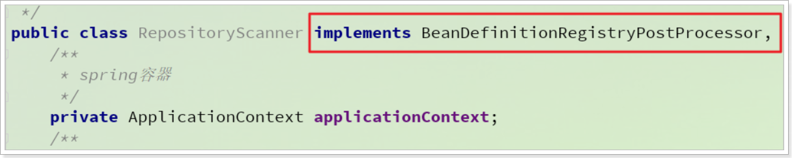

并且实现了对应的方法：

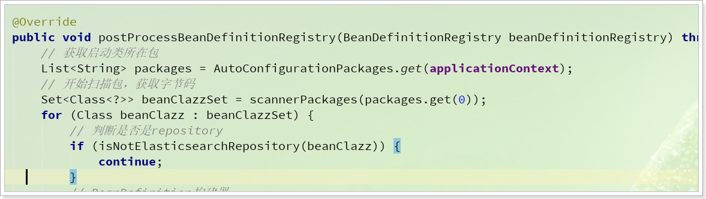


在这个方法中，我们过滤出哪些实现了Repository接口的class：

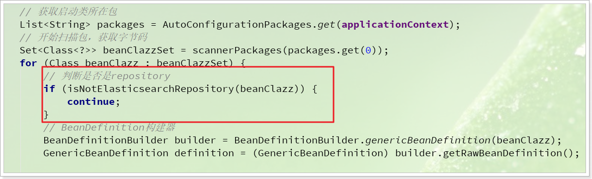

isNotElasticsearchRepository方法：

```java
private boolean isNotElasticsearchRepository(Class beanClazz) {
    return !beanClazz.isInterface() || beanClazz.getInterfaces().length <= 0 || beanClazz.getInterfaces()[0] != Repository.class;
}
```


并且通过BeanDefinitionBuilder来构建BeanDefinition:

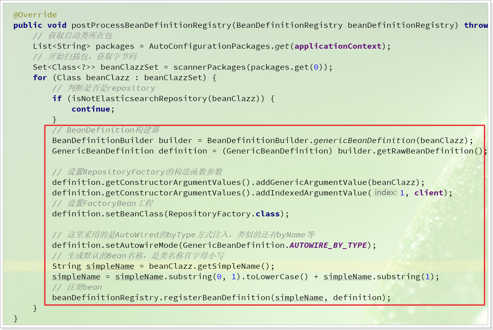


## 1.4.编写starter(了解)

starter的目的是减少用户要做的配置，并且让这些配置自动被扫描生效。在当前案例中，我们需要让之前写的`RepositoryScanner`这个类可以被实例化，并注册为一个Spring的Bean。而`RepositoryScanner`在实例化的时候又需要1个东西：

- HighLevelRestClient对象

而HighLevelRestClient对象在初始化的过程中，又需要知道elasticsearch集群的地址信息。


### 1.4.1.读取elasticsearch地址

我们约定用户会在yml文件中添加这样的配置来指定elasticsearch的地址：

```yaml
ly:
  elasticsearch:
    hosts: http://192.168.206.99:9200
```

那么我们就必须通过代码去读取这些配置。

我们在`com.leyou.starter.elastic.config`包中，创建一个配置类`ElasticSearchAutoConfiguration`，代码如下：

```java
package com.leyou.starter.elastic.config;

import org.apache.commons.lang3.StringUtils;
import org.apache.http.HttpHost;
import org.elasticsearch.client.RestClient;
import org.elasticsearch.client.RestHighLevelClient;
import org.springframework.beans.BeansException;
import org.springframework.context.ApplicationContext;
import org.springframework.context.ApplicationContextAware;
import org.springframework.context.annotation.Bean;
import org.springframework.context.annotation.Configuration;

import java.util.stream.Stream;


@Configuration
public class ElasticSearchAutoConfiguration implements ApplicationContextAware {
	// elasticsearch的地址，默认是本机
    private String hosts = "http://127.0.0.1:9200";
    @Override
    public void setApplicationContext(ApplicationContext applicationContext) throws BeansException {
        // 读取配置文件中的 "ly.elasticsearch.hosts"属性
        this.hosts = applicationContext.getEnvironment().getProperty("ly.elasticsearch.hosts");
    }
}
```

解读：

- `ApplicationContextAware`接口：
  - spring中的Aware类型接口，Spring发现一个类实现了Aware接口，就会调用该接口的方法：`setApplicationContext(ApplicationContext applicationContext)`，并且将`ApplicationContext applicationContext`实例作为参数。这样我们就能拿到spring的容器了。
- `applicationContext.getEnvironment().getProperty("ly.elasticsearch.hosts")`：读取配置环境中的属性，这里是读取"ly.elasticsearch.hosts"属性。


### 1.4.2.配置HighLevelRestClient

有了属性，接下来就可以创建HighLevelRestClient的实例了，接着在上面的配置类：`ElasticSearchAutoConfiguration`中编写代码：

```java
package com.leyou.starter.elastic.config;
 // ...
import java.util.stream.Stream;


@Configuration
public class ElasticSearchAutoConfiguration implements ApplicationContextAware {
 // ...略
    @Bean
    @ConditionalOnMissingBean
    public RestHighLevelClient restHighLevelClient() {
        return new RestHighLevelClient(
                // 利用Builder构建器来初始化，接收HttpHost数组
                RestClient.builder(
                        // 将地址以 , 分割得到其中的每个地址
                        Stream.of(StringUtils.split(hosts, ","))
                                // 将单个地址封装为HttpHost对象
                                .map(HttpHost::create)
                                // 转为HttpHost数组
                                .toArray(HttpHost[]::new)
                )
        );
    }
 // ...略
}

```


### 1.4.3.注册`RepositoryScanner`

最后，我们来讲RepositoryScanner创建对象，并注入到Spring中。接着在上面的配置类：`ElasticSearchAutoConfiguration`中编写代码：

```java
package com.leyou.starter.elastic.config;
// ...略

@Configuration
@ConditionalOnClass({Mono.class, Flux.class, RestHighLevelClient.class})
public class ElasticSearchAutoConfiguration implements ApplicationContextAware {

// ...略

    @Bean
    public RepositoryScanner repositoryScanner() {
        return new RepositoryScanner(restHighLevelClient());
    }

// ...略
}

```

注意，类上我们加了注解：

- `@ConditionalOnClass({Mono.class, Flux.class, RestHighLevelClient.class})`：当这些类存在配置才生效

### 1.4.4.配置spring.factories

最后，为了让引用当前starter的项目可以读取到我们写的配置类，我们需要在classpath下的META-INF文件夹下，新增一个spring.factories文件，内容如下：

```properties
# Auto Configure
org.springframework.boot.autoconfigure.EnableAutoConfiguration=\
com.leyou.starter.elastic.config.ElasticSearchAutoConfiguration
```

另外，为了让用户编写application.yml文件时有提示，我们可以在META-INF文件夹下再新建一个文件，内容如下：

```json
{
  "properties": [
    {
      "name": "ly.elasticsearch.hosts",
      "type": "java.lang.String",
      "description": "elasticsearch集群中节点信息，多个以,隔开",
      "defaultValue": "http://127.0.0.1:9200"
    }
  ]
}
```


结构如图：

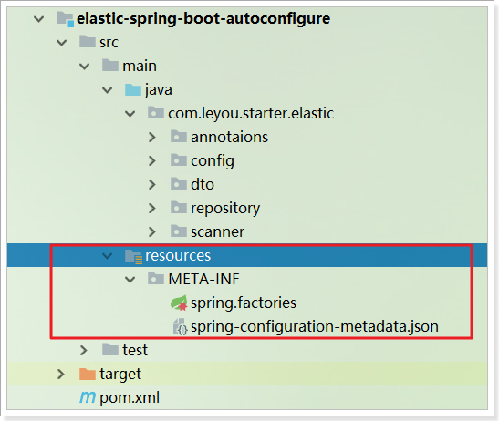 


# 2.安装es的starter到仓库

## 2.1.安装到本地仓库

最后，我们把整个项目install到本地仓库中。

如果大家没有完成，可以使用课前资料提供的`elasticsearch-spring-boot-starter`项目即可：

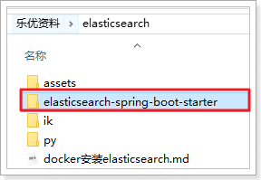 

然后有两种安装方式。

### 2.1.1.IDEA导入

你可以使用Idea直接打开项目，查看源码：

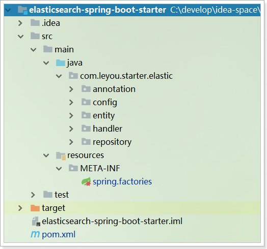 

然后在窗口的右侧，通过maven窗口中的install命令，安装代码到本地仓库：

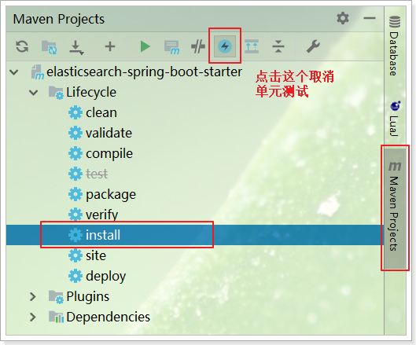 


### 2.1.2.命令行导入

IDEA方式安装本地仓库并不包含源码，如果要把源码也安装到本地仓库，需要执行mvn命令。

在项目根目录下，打开控制台，输入命令：

```sh
mvn source:jar install -Dmaven.test.skip=true
```

如图：

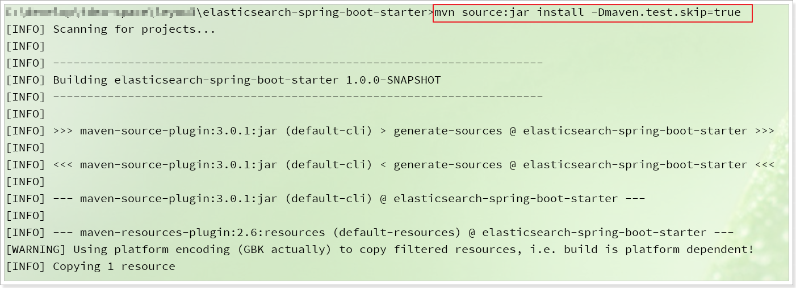

打开本地仓库目录，可以看到已经安装完毕：

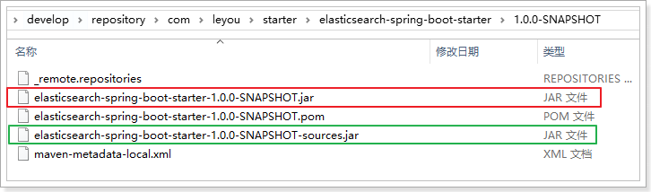 


## 2.2.功能测试

下面，我们通过案例来演示下如何使用。

### 2.2.1.创建demo工程

首先，我们创建一个新的工程：


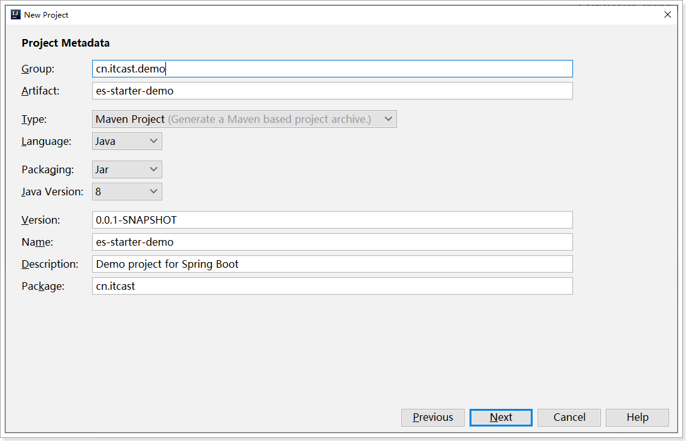

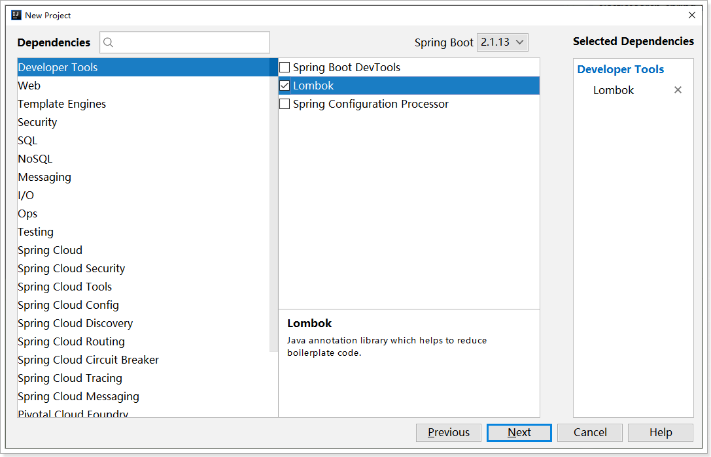


在pom文件中加入自定义的starter的依赖：

```xml
<!--自定义elasticsearch的starter-->
<dependency>
    <groupId>com.leyou</groupId>
    <artifactId>elastic-spring-boot-starter</artifactId>
    <version>1.0.0-SNAPSHOT</version>
</dependency>
```

另外，SpringBoot会自定义es的版本为6.4.3，这里要强制修改为7.4.2

```xml
    <properties>
        <java.version>1.8</java.version>
        <elasticsearch.version>7.4.2</elasticsearch.version>
    </properties>
```

完整依赖如下：

```xml
<?xml version="1.0" encoding="UTF-8"?>
<project xmlns="http://maven.apache.org/POM/4.0.0" xmlns:xsi="http://www.w3.org/2001/XMLSchema-instance"
         xsi:schemaLocation="http://maven.apache.org/POM/4.0.0 https://maven.apache.org/xsd/maven-4.0.0.xsd">
    <modelVersion>4.0.0</modelVersion>
    <parent>
        <groupId>org.springframework.boot</groupId>
        <artifactId>spring-boot-starter-parent</artifactId>
        <version>2.1.12.RELEASE</version>
        <relativePath/> <!-- lookup parent from repository -->
    </parent>
    <groupId>cn.itcast.demo</groupId>
    <artifactId>es-starter-demo</artifactId>
    <version>0.0.1-SNAPSHOT</version>
    <name>es-starter-demo</name>
    <description>Demo project for Spring Boot</description>

    <properties>
        <java.version>1.8</java.version>
        <elasticsearch.version>7.4.2</elasticsearch.version>
    </properties>

    <dependencies>
        <!--自定义elasticsearch的starter-->
        <dependency>
            <groupId>com.leyou</groupId>
            <artifactId>elastic-spring-boot-starter</artifactId>
            <version>1.0.0-SNAPSHOT</version>
        </dependency>

        <dependency>
            <groupId>org.projectlombok</groupId>
            <artifactId>lombok</artifactId>
            <optional>true</optional>
        </dependency>
        <dependency>
            <groupId>org.springframework.boot</groupId>
            <artifactId>spring-boot-starter-test</artifactId>
            <scope>test</scope>
        </dependency>
    </dependencies>

    <build>
        <plugins>
            <plugin>
                <groupId>org.springframework.boot</groupId>
                <artifactId>spring-boot-maven-plugin</artifactId>
            </plugin>
        </plugins>
    </build>

</project>

```


在`cn.itcast`包创建启动类：

```java
package cn.itcast.demo;

import org.springframework.boot.SpringApplication;
import org.springframework.boot.autoconfigure.SpringBootApplication;

@SpringBootApplication
public class EsStarterDemoApplication {
    public static void main(String[] args) {
        SpringApplication.run(EsStarterDemoApplication.class, args);
    }
}
```


在application.yml中配置日志级别：

```yaml
logging:
  level:
    cn.itcast: debug
```


### 2.2.2.初始化

#### 1）配置地址

接下来，我们在`application.yml`中添加elasticsearch地址

```yaml
logging:
  level:
    cn.itcast: debug

elasticsearch:
  hosts: http://192.168.206.99:9200
```


#### 2）编写实体类

我们准备一个实体类，测试数据CRUD：

```java
package cn.itcast.demo.pojo;

import com.leyou.starter.elastic.annotation.IndexID;
import com.leyou.starter.elastic.annotation.Indices;
import lombok.AllArgsConstructor;
import lombok.Data;
import lombok.NoArgsConstructor;
import org.springframework.stereotype.Indexed;


@AllArgsConstructor
@NoArgsConstructor
@Data
@Indices("goods")
public class Goods {
    @IndexID
    private Long id;
    private String name;
    private String title;
    private Long price;
}
```

要注意，我们的自定义starter会帮我们实现各种增删改查的功能，不过需要通过两个注解来声明索引库信息：

- `@Index("goods")`：声明实体类相关的索引库名称，如果没指定，会以类名首字母小写后做索引库名称
- `@Id`：实体类中的id字段的类型，名称可以不叫id，只要加注解就可以


#### 3）准备客户端Repository

我们在`cn.itcast.demo.repository`包中创建一个接口：`GoodsRepository`，然后要继承工具包中的接口：Repository，将来该接口就会被动态代理：

```java
package cn.itcast.demo.repository;

import cn.itcast.demo.pojo.Goods;
import com.leyou.starter.elastic.repository.Repository;


public interface GoodsRepository extends Repository<Goods, Long> {
}

```


### 2.2.3.创建索引库

先来测试创建索引库代码:

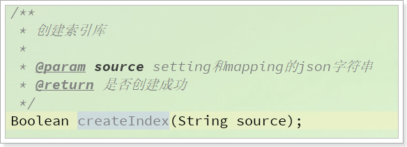 

说明，这里索引库名称会根据Repository泛型的实体类来判断，因此其它配置如：settings、mapping需要通过参数指定。参数的格式是json字符串，与kibana中的参数一致，我们可以把kibana中的json复制，粘贴进去即可:

```json
{
  "settings": {
    "analysis": {
      "analyzer": {
        "my_pinyin": {
          "tokenizer": "ik_smart",
          "filter": [
            "py"
          ]
        }
      },
      "filter": {
        "py": {
          "type": "pinyin",
          "keep_full_pinyin": false,
          "keep_joined_full_pinyin": true,
          "keep_original": true,
          "limit_first_letter_length": 16,
          "remove_duplicated_term": true
        }
      }
    }
  },
  "mappings": {
    "properties": {
      "id": {
        "type": "keyword"
      },
      "name": {
        "type": "completion",
        "analyzer": "my_pinyin",
         "search_analyzer": "ik_smart"
      },
      "title":{
        "type": "text",
        "analyzer": "my_pinyin",
        "search_analyzer": "ik_smart"
      },
      "price":{
        "type": "long"
      }
    }
  }
}
```


示例：

```java
package cn.itcast.demo;

import cn.itcast.demo.pojo.Goods;
import cn.itcast.demo.repository.GoodsRepository;
import com.leyou.starter.elastic.dto.PageInfo;
import lombok.extern.slf4j.Slf4j;
import org.elasticsearch.index.query.QueryBuilders;
import org.elasticsearch.search.builder.SearchSourceBuilder;
import org.elasticsearch.search.fetch.subphase.highlight.HighlightBuilder;
import org.junit.Test;
import org.junit.runner.RunWith;
import org.springframework.beans.factory.annotation.Autowired;
import org.springframework.boot.test.context.SpringBootTest;
import org.springframework.test.context.junit4.SpringRunner;
import reactor.core.publisher.Mono;

import java.util.ArrayList;
import java.util.List;

@Slf4j
@RunWith(SpringRunner.class)
@SpringBootTest
public class EsStarterDemoApplicationTests {

    @Autowired
    private GoodsRepository repository;

    @Test
    public void contextLoads() {
        // 创建索引库
        repository.createIndex("{\n" +
                "  \"settings\": {\n" +
                "    \"analysis\": {\n" +
                "      \"analyzer\": {\n" +
                "        \"my_pinyin\": {\n" +
                "          \"tokenizer\": \"ik_smart\",\n" +
                "          \"filter\": [\n" +
                "            \"py\"\n" +
                "          ]\n" +
                "        }\n" +
                "      },\n" +
                "      \"filter\": {\n" +
                "        \"py\": {\n" +
                "          \"type\": \"pinyin\",\n" +
                "          \"keep_full_pinyin\": false,\n" +
                "          \"keep_joined_full_pinyin\": true,\n" +
                "          \"keep_original\": true,\n" +
                "          \"limit_first_letter_length\": 16,\n" +
                "          \"remove_duplicated_term\": true\n" +
                "        }\n" +
                "      }\n" +
                "    }\n" +
                "  },\n" +
                "  \"mappings\": {\n" +
                "    \"properties\": {\n" +
                "      \"id\": {\n" +
                "        \"type\": \"keyword\"\n" +
                "      },\n" +
                "      \"name\": {\n" +
                "        \"type\": \"completion\",\n" +
                "        \"analyzer\": \"my_pinyin\"\n" +
                "      },\n" +
                "      \"title\":{\n" +
                "        \"type\": \"text\",\n" +
                "        \"analyzer\": \"my_pinyin\",\n" +
                "        \"search_analyzer\": \"ik_smart\"\n" +
                "      },\n" +
                "      \"price\":{\n" +
                "        \"type\": \"long\"\n" +
                "      }\n" +
                "    }\n" +
                "  }\n" +
                "}");
    }
}

```


### 2.2.4.文档的CRUD

文档操作主要是新增文档、删除文档、查询文档

#### 1）新增文档

API：

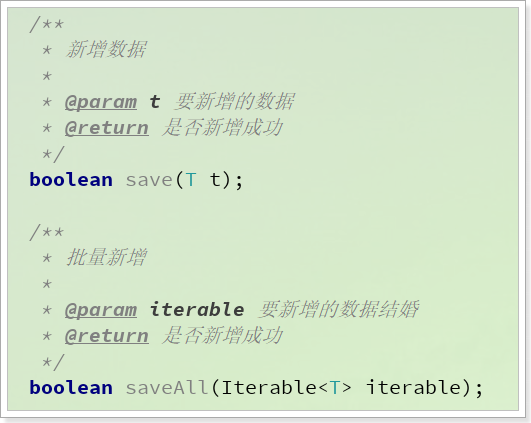 

一个是单个增、一个是批量增。

代码示例：

```java
// 单个文档的新增，id存在时会修改
@Test
public void testAddDocument(){
    repository.save(new Goods(1L, "红米9", "红米9手机 数码", 1499L));
}
// 批量增
@Test
public void testAddBatch(){
    List<Goods> list = new ArrayList<>();
    list.add(new Goods(1L, "红米9", "红米9手机 数码", 1499L));
    list.add(new Goods(2L, "三星 Galaxy A90", "三星 Galaxy A90 手机 数码 疾速5G 骁龙855", 3099L));
    list.add(new Goods(3L, "Sony WH-1000XM3", "Sony WH-1000XM3 降噪耳机 数码", 2299L));
    list.add(new Goods(4L, "松下剃须刀", "松下电动剃须刀高转速磁悬浮马达", 599L));

    repository.saveAll(list);
}
```


#### 2）文档删除

API：

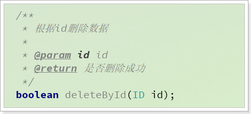 

示例：

```java
@Test
public void testDelete(){
    repository.deleteById(1L);
}
```


#### 3）根据id查询

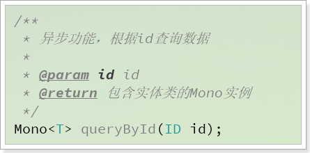 

示例：

```java
@Test
public void testGetById() throws InterruptedException {
    log.info("开始查询。。。");
    Mono<Goods> mono = repository.queryById(2L);
    mono.subscribe(System.out::println);
    log.info("查询结束。。。");

    Thread.sleep(2000L);
}
```

效果：

```
开始查询
查询代码完成
Goods(id=2, name=三星A90, title=三星 Galaxy A90 手机 数码 疾速5G, price=2499)
```


### 2.2.5.条件查询

示例代码：

```java
@Test
public void testQuery() throws InterruptedException {
    // 搜索条件的构建器
    SearchSourceBuilder sourceBuilder = new SearchSourceBuilder();
    // 1.查询条件
    sourceBuilder.query(QueryBuilders.matchQuery("title", "红米手机"));
    // 2.分页条件
    sourceBuilder.from(0);
    sourceBuilder.size(20);
    // 3.高亮条件
    sourceBuilder.highlighter(new HighlightBuilder().field("title"));

    System.out.println("开始查询。。。");
    Mono<PageInfo<Goods>> mono = repository.queryBySourceBuilderForPageHighlight(sourceBuilder);


    mono.subscribe(info -> {
        long total = info.getTotal();
        System.out.println("total = " + total);
        List<Goods> list = info.getContent();
        list.forEach(System.out::println);
    });
    System.out.println("结束查询。。。");
    Thread.sleep(2000);
}
```

结果：

```
开始查询。。。
结束查询。。。
total = 2
Goods(id=1, name=红米9, title=<em>红</em><em>米</em>9<em>手机</em> 数码, price=1499)
Goods(id=2, name=三星 Galaxy A90, title=三星 Galaxy A90 <em>手机</em> 数码 疾速5G 骁龙855, price=3099)
```


### 2.2.6.自动补全

示例代码：

```java
@Test
public void testSuggest() throws InterruptedException {
    log.info("开始查询");
    Mono<List<String>> mono = repository.suggestBySingleField("name", "s");
    mono.subscribe(list -> list.forEach(System.out::println));
    log.info("结束查询");
    Thread.sleep(2000);
}
```

结果：

```
2020-06-05 23:06:00.645  INFO 35188 --- [           main] c.i.demo.EsStarterDemoApplicationTests   : 开始查询
2020-06-05 23:06:00.806  INFO 35188 --- [           main] c.i.demo.EsStarterDemoApplicationTests   : 结束查询
Sony WH-1000XM3
三星 Galaxy A90
松下剃须刀
```


# 3.数据导入

## 3.1.前台门户

门户系统面向的是用户，安全性很重要，而且搜索引擎对于单页应用并不友好。因此我们的门户系统不再采用与后台系统类似的SPA（单页应用）。

依然是前后端分离，不过前端的页面会使用独立的html，在每个页面中使用vue来做页面渲染。

### 3.1.1.解压

将课前资料中的leyou-portal解压，并把结果复制到工作空间的目录

 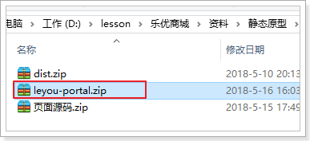

然后通过idea打开，可以看到项目结构：

 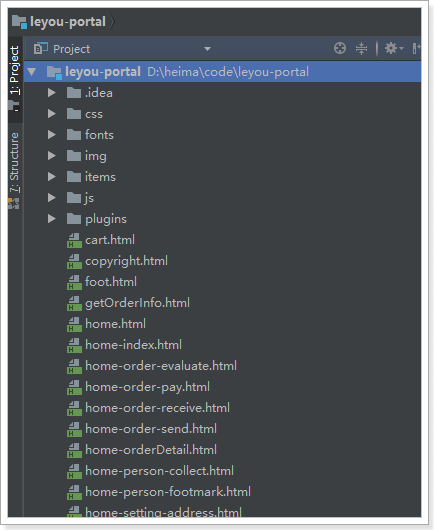


### 3.1.2.启动

我们把静态资源代码用nginx去部署加载，即可在每次启动项目时直接访问到。

假设你的静态资源代码位置如图：

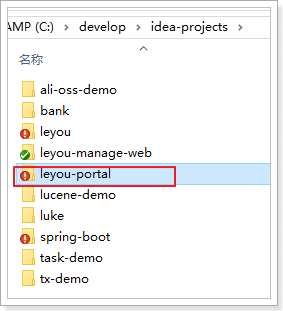 

然后修改hosts文件，添加一行配置：

```
127.0.0.1 www.leyou.com
```

修改nginx配置，将www.leyou.com反向代理到你的目录中,不要出现中文目录：

```nginx
server {
    listen       80;
    server_name  www.leyou.com;

    location / {
        root	C://develop//idea-projects/leyou-portal;
    }
}
```

重新加载nginx配置：`nginx.exe -s reload`

然后访问即可：


首页顶部的搜索框，是用户购买商品最常见的入口，下面我们就来实现搜索功能。

## 3.2.搭建搜索微服务

项目坐标：

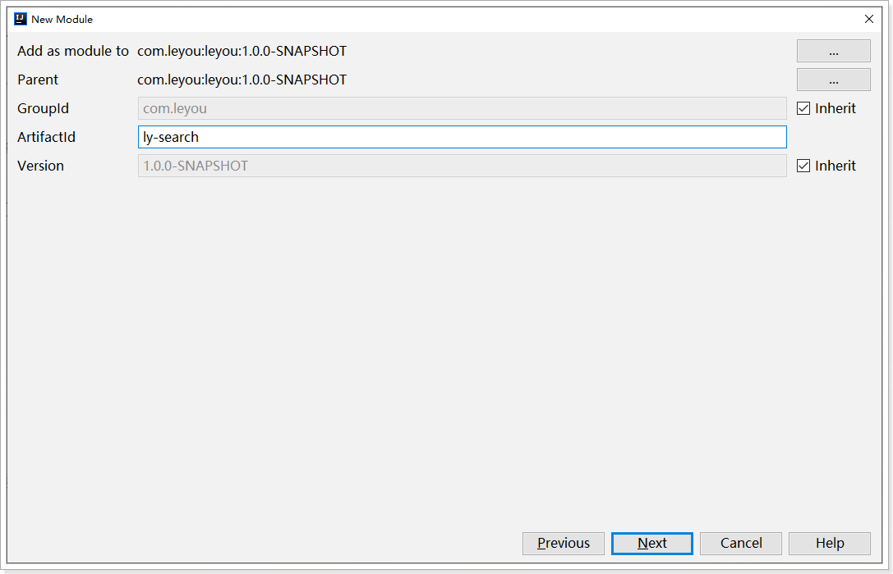

存放路径：


pom文件：

```xml
<?xml version="1.0" encoding="UTF-8"?>
<project xmlns="http://maven.apache.org/POM/4.0.0"
         xmlns:xsi="http://www.w3.org/2001/XMLSchema-instance"
         xsi:schemaLocation="http://maven.apache.org/POM/4.0.0 http://maven.apache.org/xsd/maven-4.0.0.xsd">
    <parent>
        <artifactId>leyou</artifactId>
        <groupId>com.leyou</groupId>
        <version>1.0.0-SNAPSHOT</version>
    </parent>
    <modelVersion>4.0.0</modelVersion>

    <artifactId>ly-search</artifactId>

    <dependencies>
        <dependency>
            <groupId>org.springframework.cloud</groupId>
            <artifactId>spring-cloud-starter-netflix-eureka-client</artifactId>
        </dependency>
        <dependency>
            <groupId>org.springframework.boot</groupId>
            <artifactId>spring-boot-starter-webflux</artifactId>
        </dependency>
        <dependency>
            <groupId>com.leyou</groupId>
            <artifactId>elastic-spring-boot-starter</artifactId>
            <version>1.0.0-SNAPSHOT</version>
        </dependency>
        <dependency>
            <groupId>com.leyou</groupId>
            <artifactId>ly-common</artifactId>
            <version>1.0.0-SNAPSHOT</version>
        </dependency>
    </dependencies>
    <build>
        <plugins>
            <plugin>
                <groupId>org.springframework.boot</groupId>
                <artifactId>spring-boot-maven-plugin</artifactId>
            </plugin>
        </plugins>
    </build>
</project>
```

在`ly-search`的`com.leyou.search`包下添加启动类：

```java
package com.leyou.search;

import org.springframework.boot.SpringApplication;
import org.springframework.boot.autoconfigure.SpringBootApplication;


@SpringBootApplication(scanBasePackages = {"com.leyou.search", "com.leyou.common.advice"})
public class LySearchApplication {
    public static void main(String[] args) {
        SpringApplication.run(LySearchApplication.class, args);
    }
}
```


添加配置文件`application.yml`：

```yml
server:
  port: 8083
spring:
  application:
    name: search-service
eureka:
  client:
    service-url:
      defaultZone: http://ly-registry:10086/eureka
logging:
  level:
    com.leyou: debug

elasticsearch:
  hosts: http://ly-es:9200
```


在`ly-gateway`的`application.yml`文件中添加路由配置：

```yaml
spring:
  application:
    name: ly-gateway
  cloud:
    gateway:
      # ...
      routes:
      # ...
      - id: search-service # 搜索服务
        uri: lb://search-service
        predicates:
        - Path=/search/**
```


## 3.3.索引库数据结构

我们存入elasticsearch的数据包含spu、sku、spuDetail等信息，必须组织成一个实体，然后写入。

这个实体中要包含的内容，一般需要通过搜索业务的需求来分析。来看下搜索页面：

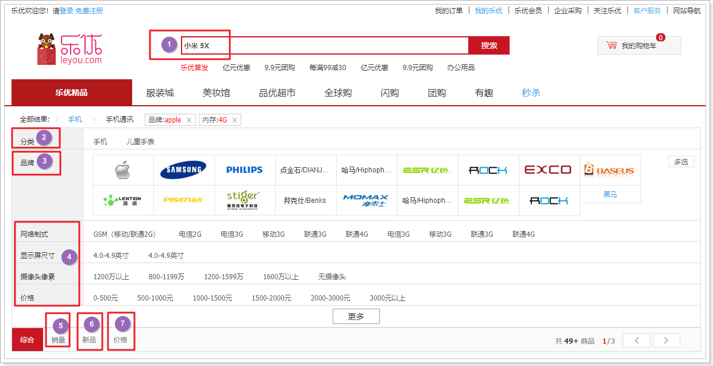

搜索的需求主要包括搜索和展示，因此其中的数据也是根据这两个需求来划分：

- 用来参与搜索的数据
    - ① 标题：用户输入关键字搜索时根据商品标题分词查询
       - ② 分类：过滤条件
        		- ③ 品牌：过滤条件
          - ④ 规格参数：过滤条件，会随着商品变化而变化
          - ⑤ 销量：排序条件
          - ⑥ 更新时间：排序条件
          - ⑦ 价格：排序条件

 

- 用来参与展示的数据
  		图片、价格、标题、销量、商品id


我们存入Elasticsearch的最终实体类：

```java
package com.leyou.search.entity;

import com.leyou.starter.elastic.annotation.IndexID;
import com.leyou.starter.elastic.annotation.Indices;
import lombok.Data;

import java.util.Date;
import java.util.List;
import java.util.Map;
import java.util.Set;


@Data
@Indices("goods")
public class Goods {

    /**
     * 商品的id
     */
    @IndexID
    private Long id;
    /**
     * 商品标题，用于搜索
     */
    private String title;
    /**
     * 商品预览图，从sku中取出一个即可
     */
    private String image;
    /**
     * 自动补全的候选字段，可以包含多个值，例如分类名称、品牌名称、商品名称
     */
    private List<String> suggestion;
    /**
     * 商品分类，包含id和name
     */
    private Long categoryId;
    /**
     * 商品品牌，包含id和name
     */
    private Long brandId;
    /**
     * 规格参数的key和value对，用于过滤
     */
    private List<Map<String,Object>> specs;
    /**
     * 商品spu中的所有sku的价格集合（滤重）
     */
    private Set<Long> prices;
    /**
     * spu下的多个sku的销量之和
     */
    private Long sold;
    /**
     * 商品更新时间
     */
    private Date updateTime;
}
```

特殊字段说明：

- title：商品搜索字段，包含商品的各种信息，需要分词，并且分词器为自定义的拼音分词器

- suggestion：自动补全字段，包含商品名称、分类、品牌等信息，使用completion类型

- prices：价格，一个SPU可能包含多个价格信息，因此这里采用set集合

- sold：效率，当前spu下的多个sku的销量之和。

- specs：规格参数，因为商品规格参数数量较多，而且都是键值对格式，计划的数据格式是这样的：

  - ```json
    [
        {"name":"CPU频率", "value": "2.5Hz"},
        {"name":"CPU品牌", "value": "骁龙"},
        {"name":"内存大小", "value": "6GB"}
    ]
    ```

  - 这样的JSON风格，对应到Java中，就是List中嵌套Map：`List<Map<String,Object>>`

  - 对象数组在写入elasticsearch时，必须使用Nested格式


对应的mapping映射：

```json
PUT /goods
{
  "settings": {
    "analysis": {
      "analyzer": {
        "my_pinyin": {
          "tokenizer": "ik_smart",
          "filter": [
            "py"
          ]
        }
      },
      "filter": {
        "py": {
		  "type": "pinyin",
          "keep_full_pinyin": true,
          "keep_joined_full_pinyin": true,
          "keep_original": true,
          "limit_first_letter_length": 16,
          "remove_duplicated_term": true
        }
      }
    }
  },
  "mappings": {
    "properties": {
      "id": {
        "type": "keyword"
      },
      "suggestion": {
        "type": "completion",
        "analyzer": "my_pinyin",
        "search_analyzer": "ik_smart"
      },
      "title":{
        "type": "text",
        "analyzer": "my_pinyin",
        "search_analyzer": "ik_smart"
      },
      "image":{
        "type": "keyword",
        "index": false
      },
      "updateTime":{
        "type": "date"
      },
      "specs":{
        "type": "nested",
        "properties": {
          "name":{"type": "keyword" },
          "value":{"type": "keyword" }
        }
      }
    }
  }
}
```


## 3.4.接入Feign客户端

构建Goods时需要的数据都来自于商品微服务，主要包括下面的查询功能：

- 批量查询Spu
- 查询Spu包含的Sku
- 查询Spu的规格参数键值对信息

商品微服务需要对外提供这样的接口，我们在其它微服务中才可以调用。而远程调用需要通过Feign完成，因此我们要在ly-item-api项目中，编写Feign客户端。

### 3.4.1.ly-item提供Feign客户端

在于`ly-item-api`中创建包：`com.leyou.item.client`，然后创建`ItemClient`接口，引入下面代码：

```java
package com.leyou.item.client;

import com.leyou.common.dto.PageDTO;
import com.leyou.item.dto.*;
import org.springframework.cloud.openfeign.FeignClient;
import org.springframework.web.bind.annotation.GetMapping;
import org.springframework.web.bind.annotation.PathVariable;
import org.springframework.web.bind.annotation.RequestParam;

import java.util.List;

/**
 * Feign的原理: 对 http 请求的伪装
 * 需要知道：localhost:8081/goods/spu/page?page=1
 *  - 主机和端口：通过@FeignClient("item-service")得到服务名称，去eureka根据服务名称拉取服务列表
 *  - 请求方式： @GetMapping
 *  - 请求路径：@GetMapping("/goods/spu/page")
 *  - 请求参数：@RequestParam(value = "page", defaultValue = "1") Integer page
 *  - 返回值类型：响应体的类型
 */
@FeignClient("item-service")
public interface ItemClient {
    /**
     * 根据id查询品牌
     * @param id 品牌的id
     * @return 品牌对象
     */
    @GetMapping("/brand/{id}")
    BrandDTO queryBrandById(@PathVariable("id") Long id);

    /**
     * 根据id的查询商品分类
     * @param id 商品分类的id集
     * @return 分类
     */
    @GetMapping("/category/{id}")
    CategoryDTO queryCategoryById(@PathVariable("id") Long id);

    /**
     * 分页查询spu
     * @param page 当前页
     * @param rows 每页大小
     * @param saleable 上架商品或下降商品
     * @return 当前页商品数据
     */
    @GetMapping("/goods/spu/page")
    PageDTO<SpuDTO> querySpuByPage(
            @RequestParam(value = "page", defaultValue = "1") Integer page,
            @RequestParam(value = "rows", defaultValue = "5") Integer rows,
            @RequestParam(value = "saleable", required = false) Boolean saleable,
            @RequestParam(value = "categoryId", required = false) Long categoryId,
            @RequestParam(value = "brandId", required = false) Long brandId,
            @RequestParam(value = "id", required = false) Long id);

    /**
     * 根据spuID查询spuDetail
     * @param id spuID
     * @return SpuDetail
     */
    @GetMapping("/goods/spu/detail")
    SpuDetailDTO querySpuDetailById(@RequestParam("id") Long id);

    /**
     * 根据spuID查询sku
     * @param id spuID
     * @return sku的集合
     */
    @GetMapping("/goods/sku/of/spu")
    List<SkuDTO> querySkuBySpuId(@RequestParam("id") Long id);

    /**
     * 查询规格参数
     * @param groupId 组id
     * @param categoryId 分类id
     * @param searching 是否用于搜索
     * @return 规格组集合
     */
    @GetMapping("/spec/params")
    List<SpecParamDTO> querySpecParams(
            @RequestParam(value = "categoryId", required = false) Long categoryId,
            @RequestParam(value = "groupId", required = false) Long groupId,
            @RequestParam(value = "searching", required = false) Boolean searching
    );

    /**
     * 根据spuId查询spu的所有规格参数值
     * @param id spu的id
     * @param searching 是否参与搜索
     * @return 规格参数值
     */
    @GetMapping("/goods/spec/value")
    List<SpecParamDTO> querySpecsValues(
            @RequestParam("id") Long id,
            @RequestParam(value = "searching", required = false) Boolean searching);

    /**
     * 根据分类id查询分类集合
     * @param idList id集合
     * @return category集合
     */
    @GetMapping("/category/list")
    List<CategoryDTO> queryCategoryByIds(@RequestParam("ids") List<Long> idList);

    /**
     * 根据品牌id查询分类集合
     * @param idList id集合
     * @return category集合
     */
    @GetMapping("/brand/list")
    List<BrandDTO> queryBrandByIds(@RequestParam("ids") List<Long> idList);

    /**
     * 根据id批量查询sku
     * @param ids skuId的集合
     * @return sku的集合
     */
    @GetMapping("/goods/sku/list")
    List<SkuDTO> querySkuByIds(@RequestParam("ids") List<Long> ids);
    /**
     * 根据id查询商品
     * @param id 商品id
     * @return 商品信息
     */
    @GetMapping("/goods/{id}")
    SpuDTO queryGoodsById(@PathVariable("id") Long id);

    /**
     * 根据id查询spu，不包含别的
     * @param id 商品id
     * @return spu
     */
    @GetMapping("/goods/spu/{id}")
    SpuDTO querySpuById(@PathVariable("id") Long id);

    /**
     * 根据分类id查询规格组及组内参数
     * @param id 分类id
     * @return 组及组内参数
     */
    @GetMapping("/spec/list")
    List<SpecGroupDTO> querySpecList(@RequestParam("id") Long id);
}
```


### 3.4.2.ly-search引入Feign客户端

接下来，我们在ly-search中引入刚刚定义的Feign客户端

#### 1）引入依赖

在`ly-search`的`pom.xml`中引入`ly-item-api`和`OpenFeign`的依赖：

```xml
<dependency>
    <groupId>org.springframework.cloud</groupId>
    <artifactId>spring-cloud-starter-openfeign</artifactId>
</dependency>
<dependency>
    <groupId>com.leyou</groupId>
    <artifactId>ly-item-api</artifactId>
    <version>1.0.0-SNAPSHOT</version>
</dependency>
```


#### 2）启用FeignClient功能

在启动类`LySearchApplication`上添加注解，开启Feign功能：

`@EnableFeignClients(basePackages = "com.leyou.item.client")`

```java
package com.leyou.search;

import org.springframework.boot.SpringApplication;
import org.springframework.boot.autoconfigure.SpringBootApplication;
import org.springframework.cloud.openfeign.EnableFeignClients;


@EnableFeignClients(basePackages = "com.leyou.item.client")
@SpringBootApplication(scanBasePackages = {"com.leyou.search", "com.leyou.common.advice"})
public class LySearchApplication {
    public static void main(String[] args) {
        SpringApplication.run(LySearchApplication.class, args);
    }
}
```


#### 3）单元测试

我们编写一个单元测试，看看是否好用。

在`ly-search`的`test`下的`com.leyou.search.client`包下新建一个测试类：

```java
package com.leyou.search.client;

import com.leyou.item.client.ItemClient;
import com.leyou.item.dto.SpecParamDTO;
import org.junit.Test;
import org.junit.runner.RunWith;
import org.springframework.beans.factory.annotation.Autowired;
import org.springframework.boot.test.context.SpringBootTest;
import org.springframework.test.context.junit4.SpringRunner;

import java.util.List;


@RunWith(SpringRunner.class)
@SpringBootTest
public class FeignTest {

    @Autowired
    private ItemClient itemClient;

    @Test
    public void testQuerySpecValues(){
        List<SpecParamDTO> list = itemClient.querySpecsValues(114L, true);

        list.forEach(System.out::println);
    }
}
```


## 3.5.完成数据导入

接下来我们就查询数据，并完成索引库数据导入。

### 3.5.1.创建Repository

首先，我们需要创建一个Repository，继承ElasticsearchRepository。

我们在`ly-search`的`com.leyou.search.repository`中定义类：

```java
package com.leyou.search.repository;

import com.leyou.search.entity.Goods;
import com.leyou.starter.elastic.repository.Repository;


public interface GoodsRepository extends Repository<Goods, Long> {
}
```


### 3.5.2.创建索引库

我们在`ly-search`的`com.leyou.search.service`包中创建一个`SearchService`接口：

```java
package com.leyou.search.service;


public interface SearchService {
    /**
     * 创建索引库并设置映射
     */
    void createIndexAndMapping();

    /**
     * 加载数据到索引库
     */
    void loadData();
}
```

这里定义了两个方法，一个用来创建索引库，一个用来加载数据到索引库


然后我们在`ly-search`的`com.leyou.search.service.impl`包中创建一个`SearchServiceImpl`实现类：

```java
package com.leyou.search.service.impl;

import com.leyou.search.repository.GoodsRepository;
import com.leyou.search.service.SearchService;
import org.springframework.beans.factory.annotation.Autowired;
import org.springframework.stereotype.Service;


@Slf4j
@Service
public class SearchServiceImpl implements SearchService {

    private final GoodsRepository goodsRepository;

    private final ItemClient itemClient;

    public SearchServiceImpl(GoodsRepository goodsRepository, ItemClient itemClient) {
        this.goodsRepository = goodsRepository;
        this.itemClient = itemClient;
    }
    
    @Override
    public void createIndexAndMapping() {
        // 删除已经存在的索引库
        try {
            repository.deleteIndex();
        } catch (Exception e) {
            log.error("删除失败，可能索引库不存在！", e);
        }
        // 然后创建一个新的
        goodsRepository.createIndex("{\n" +
                "  \"settings\": {\n" +
                "    \"analysis\": {\n" +
                "      \"analyzer\": {\n" +
                "        \"my_pinyin\": {\n" +
                "          \"tokenizer\": \"ik_smart\",\n" +
                "          \"filter\": [\n" +
                "            \"py\"\n" +
                "          ]\n" +
                "        }\n" +
                "      },\n" +
                "      \"filter\": {\n" +
                "        \"py\": {\n" +
                "\t\t  \"type\": \"pinyin\",\n" +
                "          \"keep_full_pinyin\": true,\n" +
                "          \"keep_joined_full_pinyin\": true,\n" +
                "          \"keep_original\": true,\n" +
                "          \"limit_first_letter_length\": 16,\n" +
                "          \"remove_duplicated_term\": true\n" +
                "        }\n" +
                "      }\n" +
                "    }\n" +
                "  },\n" +
                "  \"mappings\": {\n" +
                "    \"properties\": {\n" +
                "      \"id\": {\n" +
                "        \"type\": \"keyword\"\n" +
                "      },\n" +
                "      \"suggestion\": {\n" +
                "        \"type\": \"completion\",\n" +
                "        \"analyzer\": \"my_pinyin\",\n" +
                "        \"search_analyzer\": \"ik_smart\"\n" +
                "      },\n" +
                "      \"title\":{\n" +
                "        \"type\": \"text\",\n" +
                "        \"analyzer\": \"my_pinyin\",\n" +
                "        \"search_analyzer\": \"ik_smart\"\n" +
                "      },\n" +
                "      \"image\":{\n" +
                "        \"type\": \"keyword\",\n" +
                "        \"index\": false\n" +
                "      },\n" +
                "      \"updateTime\":{\n" +
                "        \"type\": \"date\"\n" +
                "      },\n" +
                "      \"specs\":{\n" +
                "        \"type\": \"nested\",\n" +
                "        \"properties\": {\n" +
                "          \"name\":{\"type\": \"keyword\" },\n" +
                "          \"value\":{\"type\": \"keyword\" }\n" +
                "        }\n" +
                "      }\n" +
                "    }\n" +
                "  }\n" +
                "}");
    }

    @Override
    public void loadData() {

    }
}
```


### 3.5.3.批量导入

我们在`ly-search`的`com.leyou.search.service.impl`包中的`SearchServiceImpl`的`loadData()`方法中完成数据导入逻辑：

- 批量查询Spu
- 将查询到的Spu的集合转为Goods对象的集合
- 调用repository的saveAll方法，批量存入Elasticsearch

代码如下：

```java
 @Override
    public void loadData() {
        int page = 1, rows = 100;
        while (true) {
            log.info("开始导入第{}页数据", page);
            // 分页查询已经上架的spu
            PageDTO<SpuDTO> result = itemClient.querySpuByPage(page, rows, true, null, null, null);
            List<SpuDTO> list = result.getItems();

            // 遍历Spu集合，把SpuDTO通过buildGoods方法转为Goods
            List<Goods> goodsList = list.stream()
                    .map(this::buildGoods).collect(Collectors.toList());

            // 批量写入Elasticsearch
            repository.saveAll(goodsList);
            log.info("导入第{}页数据结束。", page);
            // 翻页
            page++;

            // 获取总页数
            Long totalPage = result.getTotalPage();
            // 判断是否还有spu没有查询
            if (page > totalPage) {
                // 没有则结束
                break;
            }
        }
    }
```


在方法执行过程中，需要调用buildGoods方法，将查询到的Spu变为Goods对象，因此我们要定义一个这样的方法。

### 3.5.4.构建Goods

我们要定义一个方法，将查询到的Spu变为Goods对象。

我们在`ly-search`的`com.leyou.search.service.impl`包中的`SearchServiceImpl`添加一个`buildGoods()`方法：

```java
private Goods buildGoods(SpuDTO spu) {
        // 1.自动补全的提示字段
        List<String> suggestion = new ArrayList<>(
                Arrays.asList(StringUtils.split(spu.getCategoryName(), "/")));
        suggestion.add(spu.getName());
        suggestion.add(spu.getBrandName());

        // 2.sku的价格集合
        // 2.1.查询sku集合
        List<SkuDTO> skuList = spu.getSkus();
        if (CollectionUtils.isEmpty(skuList)) {
            // 没有sku，我们去查询
            skuList = itemClient.querySkuBySpuId(spu.getId());
        }
        // 2.2.获取价格集合
        Set<Long> prices = skuList.stream().map(SkuDTO::getPrice).collect(Collectors.toSet());

        // 3.商品销量
        long sold = skuList.stream().mapToLong(SkuDTO::getSold).sum();

        // 4.sku的某个图片
        String image = StringUtils.substringBefore(skuList.get(0).getImages(), ",");

        // 5.规格参数
        List<Map<String, Object>> specs = new ArrayList<>();
        // 5.1.查询规格参数name和value键值对，只查询参与搜索的
        List<SpecParamDTO> params = itemClient.querySpecsValues(spu.getId(), true);
        // 5.2.封装
        for (SpecParamDTO param : params) {
            Map<String, Object> map = new HashMap<>(2);
            map.put("name", param.getName());
            map.put("value", chooseSegment(param));
            specs.add(map);
        }

        // 创建Goods对象，并封装数据
        Goods goods = new Goods();
        goods.setUpdateTime(new Date());
        // 自动补全的提示字段
        goods.setSuggestion(suggestion);
        // 规格参数
        goods.setSpecs(specs);
        // 商品销量
        goods.setSold(sold);
        // 商品标题
        goods.setTitle(spu.getTitle() + StringUtils.join(suggestion, " "));
        // sku的价格集合
        goods.setPrices(prices);
        // sku的某个图片
        goods.setImage(image);
        goods.setCategoryId(spu.getCid3());
        goods.setBrandId(spu.getBrandId());
        goods.setId(spu.getId());
        return goods;
    }
```

其中有一部分处理数字value的代码，被封装到了另两个方法中：

```java
private Object chooseSegment(SpecParamDTO p) {
        Object value = p.getValue();
        if (value == null || StringUtils.isBlank(value.toString())) {
            return "其它";
        }
        if (!p.getNumeric() || StringUtils.isBlank(p.getSegments()) || value instanceof Collection) {
            return value;
        }
        double val = parseDouble(value.toString());
        String result = "其它";
        // 保存数值段
        for (String segment : p.getSegments().split(",")) {
            String[] segs = segment.split("-");
            // 获取数值范围
            double begin = parseDouble(segs[0]);
            double end = Double.MAX_VALUE;
            if (segs.length == 2) {
                end = parseDouble(segs[1]);
            }
            // 判断是否在范围内
            if (val >= begin && val < end) {
                if (segs.length == 1) {
                    result = segs[0] + p.getUnit() + "以上";
                } else if (begin == 0) {
                    result = segs[1] + p.getUnit() + "以下";
                } else {
                    result = segment + p.getUnit();
                }
                break;
            }
        }
        return result;
    }

    private double parseDouble(String str) {
        try {
            return Double.parseDouble(str);
        } catch (Exception e) {
            return 0;
        }
    }
```


（可选的优化）另外，我们写入索引库的数据，将来参与展示的字段只包含：

- id
- title
- image
- price
- sold

其它字段不包含，也就不需要存储的。

如果要控制存储到索引库的数据，可以通过在创建mapping时，限制`_source`来实现


### 3.5.5.定义controller

为了方便后期同学们导入数据，我们定义一个controller，调用刚才的功能。

我们在`ly-search`的`com.leyou.search.web`包中编写`SearchController`功能：

```java
package com.leyou.search.web;

import com.leyou.search.service.SearchService;
import org.springframework.http.ResponseEntity;
import org.springframework.web.bind.annotation.GetMapping;
import org.springframework.web.bind.annotation.RequestMapping;
import org.springframework.web.bind.annotation.RestController;


@RestController
@RequestMapping("goods")
public class SearchController {

    private final SearchService searchService;

    public SearchController(SearchService searchService) {
        this.searchService = searchService;
    }

    /**
     * 初始化索引库
     */
    @GetMapping("initialization")
    public ResponseEntity<String> init() {
        searchService.createIndexAndMapping();
        searchService.loadData();
        return ResponseEntity.ok("导入成功");
    }
}
```


